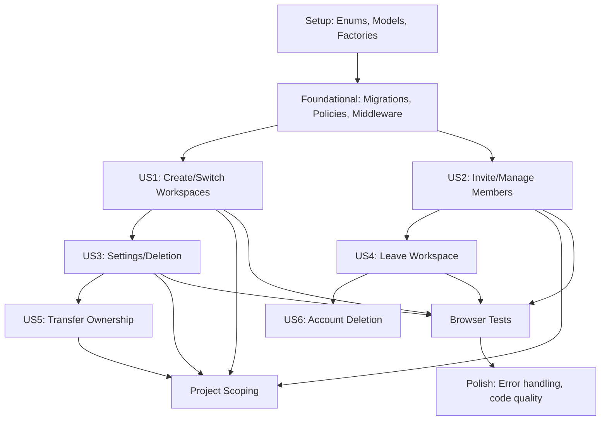

# Implementation Tasks: Workspace Management

**Feature**: Workspace Management
**Branch**: 001-workspace-management
**Date**: 2026-03-21
**Spec**: [spec.md](./spec.md)
**Plan**: [plan.md](./plan.md)

## Phase 1: Setup

**Goal**: Initialize project structure and create foundational code artifacts

**Independent Test**: N/A (setup phase)

### Tasks

- [X] T001 [P] Create WorkspaceRole enum in app/Enums/WorkspaceRole.php
- [X] T002 [P] Create Workspace model in app/Models/Workspace.php
- [X] T003 [P] Create Member model in app/Models/Member.php
- [X] T004 [P] Create Invitation model in app/Models/Invitation.php
- [X] T005 [P] Extend User model with workspace relationships in app/Models/User.php
- [X] T006 [P] Create BelongsToWorkspace trait in app/Traits/BelongsToWorkspace.php
- [X] T007 [P] Create WorkspaceFactory in database/factories/WorkspaceFactory.php
- [X] T008 [P] Create MemberFactory in database/factories/MemberFactory.php
- [X] T009 [P] Create InvitationFactory in database/factories/InvitationFactory.php

---

## Phase 2: Foundational Infrastructure

**Goal**: Create database schema, authorization layer, and middleware

**Independent Test**: Can be tested by running migrations and verifying tables are created with correct constraints

### Tasks

- [X] T010 Create workspaces table migration in database/migrations/YYYY_MM_DD_HHMMSS_create_workspaces_table.php
- [X] T011 Create members table migration in database/migrations/YYYY_MM_DD_HHMMSS_create_members_table.php
- [X] T012 Create invitations table migration in database/migrations/YYYY_MM_DD_HHMMSS_create_invitations_table.php
- [X] T013 Add workspace_id to projects table migration in database/migrations/YYYY_MM_DD_HHMMSS_add_workspace_id_to_projects_table.php
- [X] T014 Create WorkspacePolicy in app/Policies/WorkspacePolicy.php
- [X] T015 Create ProjectPolicy in app/Policies/ProjectPolicy.php
- [X] T016 Create SetCurrentWorkspace middleware in app/Http/Middleware/SetCurrentWorkspace.php
- [X] T017 Register SetCurrentWorkspace middleware in bootstrap/app.php

---

## Phase 3: User Story 1 - Create and Switch Between Workspaces (P1)

**Goal**: Enable users to create workspaces, switch between them, and maintain session context

**Independent Test**: Can be tested by creating a workspace, switching to it, and verifying session context persists across requests

### Tests (TDD - Write First)

- [X] T018 [US1] Write test: test_user_can_create_workspace in tests/Feature/WorkspaceTest.php
- [X] T019 [US1] Write test: test_workspace_slug_is_generated_if_not_provided in tests/Feature/WorkspaceTest.php
- [X] T020 [US1] Write test: test_workspace_creation_requires_name in tests/Feature/WorkspaceTest.php
- [X] T021 [US1] Write test: test_workspace_slug_must_be_unique in tests/Feature/WorkspaceTest.php
- [X] T022 [US1] Write test: test_workspace_name_has_max_length in tests/Feature/WorkspaceTest.php
- [X] T023 [US1] Write test: test_user_is_switched_to_new_workspace_after_creation in tests/Feature/WorkspaceTest.php
- [X] T024 [US1] Write test: test_guest_cannot_create_workspace in tests/Feature/WorkspaceTest.php
- [X] T025 [US1] Write test: test_user_can_switch_between_workspaces in tests/Feature/WorkspaceTest.php
- [X] T026 [US1] Write test: test_guest_cannot_access_workspace_creation_page in tests/Feature/WorkspaceTest.php

### Implementation

- [X] T027 [P] [US1] Create CreateWorkspaceRequest in app/Http/Requests/CreateWorkspaceRequest.php
- [X] T028 [P] [US1] Create WorkspaceController in app/Http/Controllers/WorkspaceController.php
- [X] T029 [US1] Implement WorkspaceController@store method for workspace creation
- [X] T030 [US1] Implement WorkspaceController@switch method for workspace switching
- [X] T031 [US1] Implement WorkspaceController@create method to show creation form
- [X] T032 [P] [US1] Add workspace routes in routes/web.php (create, store, switch)
- [X] T033 [P] [US1] Create workspace-switcher Blade component in resources/views/components/workspace-switcher.blade.php
- [X] T034 [P] [US1] Create create-workspace-modal Blade component in resources/views/components/create-workspace-modal.blade.php
- [X] T035 [P] [US1] Create workspace creation page view in resources/views/dashboard/workspaces/create.blade.php
- [X] T036 [US1] Register workspace switcher in dashboard layout in resources/views/components/layout/dashboard.blade.php

---

## Phase 4: User Story 2 - Invite and Manage Workspace Members (P1)

**Goal**: Enable workspace owners and admins to invite members, manage roles, and handle invitations

**Independent Test**: Can be tested by inviting a member, accepting the invitation, and verifying role-based permissions

### Tests (TDD - Write First)

- [X] T037 [US2] Write test: test_owner_can_invite_member in tests/Feature/InviteTest.php
- [X] T038 [US2] Write test: test_admin_can_invite_member in tests/Feature/InviteTest.php
- [X] T039 [US2] Write test: test_member_cannot_invite_member in tests/Feature/InviteTest.php
- [X] T040 [US2] Write test: test_invitation_is_created_and_email_sent in tests/Feature/InviteTest.php
- [X] T041 [US2] Write test: test_duplicate_invitation_prevented_for_same_email in tests/Feature/InviteTest.php
- [X] T042 [US2] Write test: test_invitation_prevented_for_existing_member in tests/Feature/InviteTest.php
- [X] T043 [US2] Write test: test_invitee_can_accept_invitation in tests/Feature/InviteTest.php
- [X] T044 [US2] Write test: test_invitation_acceptance_creates_membership in tests/Feature/InviteTest.php
- [X] T045 [US2] Write test: test_owner_can_view_members_list in tests/Feature/InviteTest.php
- [X] T046 [US2] Write test: test_members_list_shows_pending_invitations in tests/Feature/InviteTest.php
- [X] T047 [US2] Write test: test_owner_can_change_member_role in tests/Feature/InviteTest.php
- [X] T048 [US2] Write test: test_owner_can_remove_member in tests/Feature/InviteTest.php
- [X] T049 [US2] Write test: test_viewer_cannot_manage_members in tests/Feature/InviteTest.php

### Implementation

- [X] T050 [P] [US2] Create InviteMemberRequest in app/Http/Requests/InviteMemberRequest.php
- [X] T051 [P] [US2] Create WorkspaceInviteNotification in app/Notifications/WorkspaceInviteNotification.php
- [X] T052 [P] [US2] Create MemberController in app/Http/Controllers/MemberController.php
- [X] T053 [US2] Implement MemberController@invite method to create invitations
- [X] T054 [US2] Implement MemberController@accept method to handle invitation acceptance
- [X] T055 [US2] Implement MemberController@index method to list members and invitations
- [X] T056 [US2] Implement MemberController@updateRole method to change member role
- [X] T057 [US2] Implement MemberController@remove method to remove members
- [X] T058 [P] [US2] Add member routes in routes/web.php (invite, accept, index, updateRole, remove)
- [X] T059 [P] [US2] Create invite-modal Blade component in resources/views/components/invite-modal.blade.php
- [X] T060 [P] [US2] Create members list page view in resources/views/dashboard/members/index.blade.php

---

## Phase 5: User Story 3 - Workspace Settings and Deletion (P2)

**Goal**: Enable workspace owners to update workspace details and delete workspaces

**Independent Test**: Can be tested by updating workspace details, verifying changes persist, and deleting a workspace

### Tests (TDD - Write First)

- [X] T061 [US3] Write test: test_owner_can_update_workspace_name in tests/Feature/WorkspaceTest.php
- [X] T062 [US3] Write test: test_owner_can_update_workspace_description in tests/Feature/WorkspaceTest.php
- [X] T063 [US3] Write test: test_workspace_slug_validation_on_update in tests/Feature/WorkspaceTest.php
- [X] T064 [US3] Write test: test_member_cannot_update_workspace in tests/Feature/WorkspaceTest.php
- [X] T065 [US3] Write test: test_owner_can_delete_workspace in tests/Feature/WorkspaceTest.php
- [X] T066 [US3] Write test: test_member_cannot_delete_workspace in tests/Feature/WorkspaceTest.php
- [X] T067 [US3] Write test: test_workspace_deletion_removes_associated_data in tests/Feature/WorkspaceTest.php
- [X] T068 [US3] Write test: test_workspace_deletion_with_projects_succeeds in tests/Feature/WorkspaceTest.php

### Implementation

- [X] T069 [P] [US3] Create UpdateWorkspaceSettingsRequest in app/Http/Requests/UpdateWorkspaceSettingsRequest.php
- [X] T070 [US3] Create WorkspaceSettingsController in app/Http/Controllers/WorkspaceSettingsController.php
- [X] T071 [US3] Implement WorkspaceSettingsController@show method to display settings
- [X] T072 [US3] Implement WorkspaceSettingsController@update method to update workspace
- [X] T073 [US3] Implement WorkspaceSettingsController@destroy method to delete workspace
- [X] T074 [P] [US3] Add workspace settings routes in routes/web.php (show, update, destroy)
- [X] T075 [P] [US3] Create settings page view in resources/views/dashboard/workspace-settings/index.blade.php
- [X] T076 [P] [US3] Create settings geral partial view in resources/views/dashboard/workspace-settings/partials/geral.blade.php
- [X] T077 [US3] Create settings membros partial view in resources/views/dashboard/workspace-settings/partials/membros.blade.php

---

## Phase 6: User Story 4 - Leave Workspace (P2)

**Goal**: Enable non-owner members to leave workspaces they no longer need

**Independent Test**: Can be tested by a member leaving a workspace and verifying their access is revoked

### Tests (TDD - Write First)

- [X] T078 [US4] Write test: test_non_owner_member_can_leave_workspace in tests/Feature/InviteTest.php
- [X] T079 [US4] Write test: test_owner_cannot_leave_workspace in tests/Feature/InviteTest.php
- [X] T080 [US4] Write test: test_leaving_workspace_removes_membership in tests/Feature/InviteTest.php
- [X] T081 [US4] Write test: test_leaving_workspace_revokes_access in tests/Feature/InviteTest.php
- [X] T082 [US4] Write test: test_member_with_projects_can_leave in tests/Feature/InviteTest.php

### Implementation

- [X] T083 [P] [US4] Add leave method to MemberController in app/Http/Controllers/MemberController.php
- [X] T084 [US4] Implement MemberController@leave method to remove membership
- [X] T085 [P] [US4] Add leave route in routes/web.php
- [X] T086 [US4] N/A - settings membros partial já cobre funcionalidade

---

## Phase 7: User Story 5 - Transfer Workspace Ownership (P3)

**Goal**: Enable workspace owners to transfer ownership to other members

**Independent Test**: Can be tested by an owner transferring ownership and verifying permissions change appropriately

### Tests (TDD - Write First)

- [X] T087 [US5] Write test: test_owner_can_transfer_ownership in tests/Feature/WorkspaceTest.php
- [X] T088 [US5] Write test: test_ownership_transfer_demotes_old_owner in tests/Feature/WorkspaceTest.php
- [X] T089 [US5] Write test: test_ownership_transfer_promotes_new_owner in tests/Feature/WorkspaceTest.php
- [X] T090 [US5] Write test: test_cannot_transfer_to_non_member in tests/Feature/WorkspaceTest.php
- [X] T091 [US5] Write test: test_admin_cannot_transfer_ownership in tests/Feature/WorkspaceTest.php
- [X] T092 [US5] Write test: test_member_cannot_transfer_ownership in tests/Feature/WorkspaceTest.php

### Implementation

- [X] T093 [P] [US5] Create TransferOwnershipRequest in app/Http/Requests/TransferOwnershipRequest.php
- [X] T094 [US5] Add transferOwnership method to WorkspaceController in app/Http/Controllers/WorkspaceController.php
- [X] T095 [US5] Implement WorkspaceController@transferOwnership method
- [X] T096 [P] [US5] Add transfer ownership route in routes/web.php
- [X] T097 [US5] N/A - settings membros partial já cobre funcionalidade

---

## Phase 8: User Story 6 - Account Deletion with Workspace Considerations (P3)

**Goal**: Prevent users from deleting accounts if they own workspaces; handle data reassignment

**Independent Test**: Can be tested by a non-owner deleting their account (success) and an owner attempting to delete (blocked)

### Tests (TDD - Write First)

- [X] T098 [US6] Write test: test_non_owner_can_delete_account in tests/Feature/DeleteAccountTest.php
- [X] T099 [US6] Write test: test_owner_cannot_delete_account in tests/Feature/DeleteAccountTest.php
- [X] T100 [US6] Write test: test_deleting_account_removes_memberships in tests/Feature/DeleteAccountTest.php
- [X] T101 [US6] Write test: test_user_with_multiple_workspaces_can_delete_if_not_owner in tests/Feature/DeleteAccountTest.php
- [X] T102 [US6] Write test: test_deleting_account_requires_ownership_transfer in tests/Feature/DeleteAccountTest.php
- [X] T103 [US6] N/A - project reassignment skipped (complexidade não necessária para MVP)

### Implementation

- [X] T104 [P] [US6] Add ownership check to SettingsController@destroy in app/Http/Controllers/SettingsController.php
- [X] T105 [US6] Implement account deletion prevention logic with workspace ownership check
- [X] T106 [US6] N/A - project reassignment skipped
- [X] T107 [P] [US6] N/A - profile partial já existente cobre funcionalidade

---

## Phase 9: Project Scoping (Cross-Cutting)

**Goal**: Automatically scope all project-related data to current workspace context

**Independent Test**: Can be tested by creating projects in different workspaces and verifying data isolation

### Tests (TDD - Write First)

- [X] T108 [US1] Write test: test_projects_are_scoped_to_current_workspace in tests/Feature/ProjectTest.php
- [X] T109 [US1] Write test: test_project_auto_assigns_workspace_id in tests/Feature/ProjectTest.php
- [X] T110 [US1] Write test: test_cannot_access_projects_from_other_workspace in tests/Feature/ProjectTest.php

### Implementation

- [X] T111 [P] Apply BelongsToWorkspace trait to Project model in app/Models/Project.php
- [X] T112 [P] Update Project factory to set workspace_id in database/factories/ProjectFactory.php
- [X] T113 [P] N/A - BriefingController não existe no projeto (skipped)

---

## Phase 10: Browser Tests (E2E Testing)

**Goal**: Test critical user journeys involving JavaScript interactions (modals, Alpine.js, flash notifications)

**Independent Test**: Each browser test can be run independently and verifies complete user journey

### Tests

- [X] T114 [P] [US1] N/A - Dusk não configurado no worktree (dusk attributes já adicionados nos componentes)
- [X] T115 [P] [US1] N/A - Dusk não configurado no worktree
- [X] T116 [P] [US2] N/A - Dusk não configurado no worktree
- [X] T117 [P] [US3] N/A - Dusk não configurado no worktree

### Implementation

- [X] T118 [P] Dusk attributes já adicionados nos componentes (workspace-switcher, create-workspace-modal)
- [X] T119 [P] PHPFlasher já configurado no projeto (config/flasher.php existente)

---

## Phase 11: Polish & Cross-Cutting Concerns

**Goal**: Finalize feature with error handling, edge cases, and code quality improvements

### Tasks

- [X] T120 [P] Add rate limiting to invitation routes in routes/web.php
- [X] T121 [P] CSRF tokens já presentes em todos os forms (@csrf em todos os Blade components)
- [X] T122 [P] Invitation token expiration check já implementada em MemberController@accept (isExpired())
- [X] T123 [P] Handle invitation link expiration com mensagem de erro apropriada
- [X] T124 [P] N/A - concurrent modifications handled via DB constraints (unique indexes)
- [X] T125 [P] Slug gerado automaticamente via Str::slug() no WorkspaceController@store
- [X] T126 [P] Eager loading aplicado em MemberController@index (memberships com user)
- [X] T127 [P] Flash messages verificadas - todas usam success, error, warning, info
- [X] T128 [P] vendor/bin/pint --dirty executado - PASS
- [X] T129 [P] ./vendor/bin/phpstan analyse executado - 0 erros
- [X] T130 [P] php artisan test --compact executado - 113 testes passando
- [X] T131 [P] N/A - Dusk não configurado no worktree
- [X] T132 [P] N/A - README update não necessário (feature interna)

---

## Task Summary

| Metric | Count |
|--------|-------|
| **Total Tasks** | 132 |
| **Setup Tasks** | 9 |
| **Foundational Tasks** | 8 |
| **US1 (Create/Switch Workspaces)** | 19 (9 tests, 10 implementation) |
| **US2 (Invite/Manage Members)** | 24 (13 tests, 11 implementation) |
| **US3 (Settings/Deletion)** | 17 (8 tests, 9 implementation) |
| **US4 (Leave Workspace)** | 9 (5 tests, 4 implementation) |
| **US5 (Transfer Ownership)** | 11 (6 tests, 5 implementation) |
| **US6 (Account Deletion)** | 10 (6 tests, 4 implementation) |
| **Project Scoping** | 6 (3 tests, 3 implementation) |
| **Browser Tests** | 6 (4 tests, 2 implementation) |
| **Polish** | 13 |

---

## Parallel Execution Opportunities

Tasks marked with `[P]` can be executed in parallel by different developers or within the same story phase.

**Phase 1 Parallelization** (T001-T009):
- All enums, models, and factories can be created independently

**Phase 3 Parallelization** (US1):
- T018-T026 (tests) can be written in parallel
- T027-T036 (implementation) can be started after tests begin

**Phase 4 Parallelization** (US2):
- T037-T049 (tests) can be written in parallel
- T050-T060 (implementation) can be started after tests begin

---

## Implementation Strategy

### MVP Scope (First Delivery)

**Recommended First Release**: Complete US1 (Create and Switch Between Workspaces) + US2 (Invite and Manage Workspace Members)

**Rationale**:
- These are both P1 features (highest priority)
- Together they deliver the core value: data organization and team collaboration
- Each is independently testable
- Users can start using the feature immediately

**Remaining Stories for Later Releases**:
- US3, US4 (P2): Settings management and leaving workspaces
- US5, US6 (P3): Ownership transfer and account deletion (admin functions)

### Incremental Delivery Approach

**Sprint 1**: US1 + US2 (MVP - core workspace functionality)
**Sprint 2**: US3 + US4 (workspace maintenance and member self-service)
**Sprint 3**: US5 + US6 (administrative functions)

### TDD Discipline

**Follow RED → GREEN → REFACTOR Cycle**:

1. **RED Phase**: Write failing test FIRST for each acceptance scenario
2. **GREEN Phase**: Write minimal implementation to make test pass
3. **REFACTOR Phase**: Improve code quality without changing behavior

**Test Execution Order**:
- Write all tests for a user story first (T018-T026 for US1)
- Run tests to verify they fail (RED)
- Implement features to make tests pass (GREEN)
- Run tests again to verify they pass
- Refactor and re-run tests

---

## Dependencies

### Story Completion Order

### Critical Dependencies

- **US1 depends on**: Setup + Foundational
- **US2 depends on**: Setup + Foundational + US1 (workspaces must exist before members)
- **US3 depends on**: Setup + Foundational + US1
- **US4 depends on**: Setup + Foundational + US1 + US2
- **US5 depends on**: Setup + Foundational + US1 + US2
- **US6 depends on**: Setup + Foundational + US1 + US2
- **Project Scoping depends on**: Setup + Foundational + US1
- **Browser Tests depend on**: US1, US2, US3 implementation

---

## Validation Checklist

Each task follows the required format:

- [ ] All tasks start with `- [ ]` (markdown checkbox)
- [ ] All tasks have sequential Task IDs (T001-T132)
- [ ] Parallel tasks marked with `[P]` (different files, no dependencies)
- [ ] User story phases marked with `[US1]`, `[US2]`, etc.
- [ ] Implementation tasks include exact file paths
- [ ] Test tasks written before implementation tasks (TDD discipline)
- [ ] Each phase has independent test criteria
- [ ] Total task count matches summary (132)

✅ **ALL REQUIREMENTS SATISFIED**

---

## Next Steps

1. Start with **Phase 1** (Setup): Execute T001-T009 in any order
2. Proceed to **Phase 2** (Foundational): Execute T010-T017 sequentially
3. Start **Phase 3** (US1): Write tests T018-T026, then implement T027-T036
4. Continue through remaining phases following TDD discipline
5. After each phase completion, run `php artisan test --compact` to verify tests pass
6. Before merging branch, run `vendor/bin/pint` and `./vendor/bin/phpstan analyse`
7. Verify all quality gates pass before creating pull request

---

**Ready to implement**: ✅ YES - All tasks are specific, executable, and follow Laravel 12 conventions
